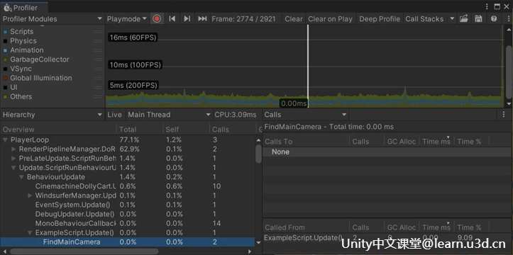
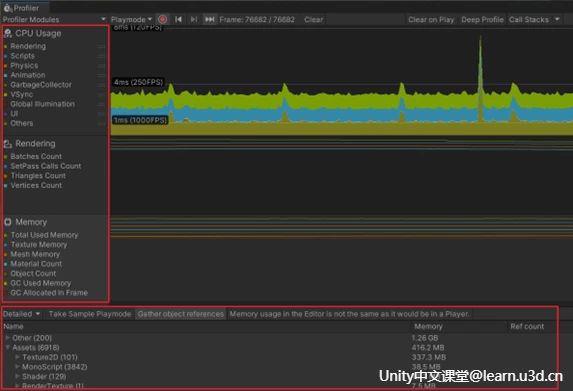
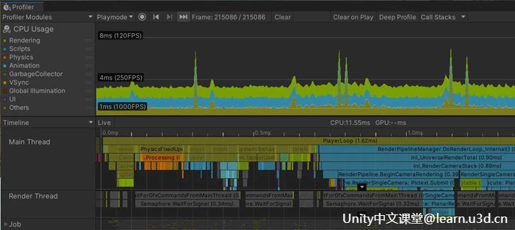
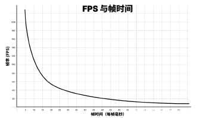
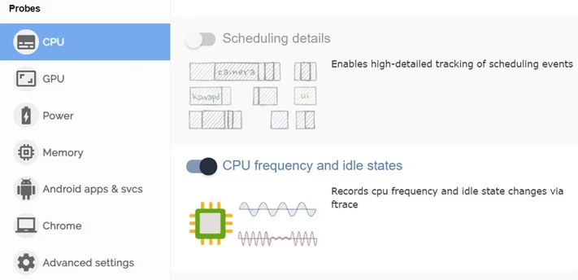
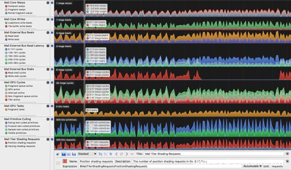

# Unity游戏性能分析指南

<!--more-->
要想为玩家创造沉浸式游戏体验，流畅的性能至关重要。精益、高性能的代码和优化的内存使用可提高低端和高端设备的性能。总体而言，良好的性能会提高玩家体验的流畅感，从而提升留存率。

Unity 中文课堂上架了[**《游戏性能分析终极指南》**](https://learn.u3d.cn/tutorial/ultimate-guide-profiling)，汇集了有关如何在 Unity 中对应用程序进行性能分析、管理其内存以及彻底优化其功耗的高级建议和知识。
## **性能分析入门**
在深入了解如何在 Unity 中对游戏进行性能分析的细节之前，让我们总结一些关键概念和性能分析原则。

各种性能分析器是开发者工具包中最有用的工具之一，用于识别代码中的内存和性能瓶颈。性能分析器可视为探测工具，帮助用户揭示应用程序性能滞后或代码分配过多内存的原因。

Unity 附带了各种性能分析工具，用于在编辑器和硬件上分析和优化用户的代码。我们还建议对每个目标平台使用原生性能分析工具，例如 Arm、Apple、PlayStation 和 Xbox 提供的工具。
### **了解 Unity 中的性能分析**
Unity 的性能分析工具可在编辑器中使用，并可通过 Package Manager 获得。

[**Unity Profiler：**](https://docs.unity3d.com/cn/current/Manual/Profiler.html)测量 Unity 编辑器、用户的应用程序在运行模式下，或在开发模式下连接到设备运行时的性能

[**Profiling Core 包：**](https://docs.unity.cn/cn/current/Manual/com.unity.profiling.core.html)提供的 API 可用于将上下文信息添加到 Unity Profiler 捕获

[**Memory Profiler：**](https://docs.unity3d.com/cn/current/Manual/UnityManual.html)提供深入的内存性能分析的工具

[**Profile Analyzer：**](https://docs.unity.cn/cn/current/Manual/com.unity.performance.profile-analyzer.html
)将两个性能分析数据集进行比对，分析用户所做的更改如何影响应用程序的性能

“Unity 性能分析和调试工具”部分详细说明了如何使用这些工具以及[帧调试器](https://docs.unity3d.com/cn/current/Manual/FrameDebugger.html)

### **基于样本的性能分析与基于检测的性能分析**
有两种常用的游戏性能分析方法 ：

 -  基于样本的性能分析

 - 基于检测的性能分析

### **基于样本的性能分析**
基于样本的性能分析对应用程序正进行的工作的统计数据进行收集并分析。

基于样本的性能分析器每隔“n”纳秒探测一次调用堆栈，并使用调用堆栈信息来确定函数何时被调用（以及由哪些函数调用），以及运行了多长时间。通过使用更高的采样率频率可以提高这种性能分析方法的准确性，因为对函数较短的调用也会在调用堆栈中捕捉到。但是，它会导致更高的开销。

### **基于检测的性能分析器**
基于检测的性能分析通过添加性能分析器标记来“检测”代码，这些标记记录有关每个标记中的代码执行多长时间的详细计时信息。此性能分析器捕获每个标记的 Begin和 End 事件流。此方法不会丢失任何信息，但它确实依赖于标记的放置以便捕获性能分析数据。

性能分析器：

[https://docs.unity3d.com/cn/current/Manual/profiler-markers.html](https://docs.unity3d.com/cn/current/Manual/profiler-markers.html)

Unity Profiler 是基于检测的。大多数 Unity API 表面中设置的标记实现了细节与开销的良好平衡。重要的原生功能和脚本代码库消息调用被用来捕获最重要的“大框架”，不会产生太多开销。

这使用户可以探查代码的性能，轻松定位性能问题，并快速发现优化位置 ；用户可以通过添加自定义性能分析器标记或使用深度性能分析来进一步分析。

深度性能分析会在每个脚本方法调用中自动插入 Begin 和 End 标记，包括 C# Getter和 Setter 属性。该系统在脚本侧提供了完整的性能分析详细信息，但它带来了相关的开销，从而导致报告的计时数据被夸大，具体取决于捕获的性能分析范围内的调用数量。

### **Unity 中基于检测的性能分析**
上面提到的脚本代码库消息调用（默认显式检测）通常包括从Unity 原生代码到托管代码的调用的第一个调用堆栈深度。比如常用的 MonoBehaviour 方法，如Start()、 Update()、FixedUpdate() 等。

 方法对 Unity Instantiate() 方法的调用")

用户还可以在 Profiler 中看到回调到 Unity API 的托管脚本代码的子示例。但是，需要注意的一点是，要检测的Unity API 代码本身需要具有检测性能分析器标记。大多数产生性能开销的 Unity API 都会被检测。例如，使用camera．main 将导致 FindMaincamera 标记出现在性能分析捕获中。在检查捕获的性能分析数据集时，了解不同标记的含义很有用。使用此常见性能分析器标记列表了解更多信息。

### **使用性能分析器标记增加性能分析细节**
默认情况下，Unity Profiler 将对显式包含在性能分析器标记中的代码计时数据进行性能分析。手动将性能分析器标记插入到代码中的关键函数中，可以有效提高性能分析运行的详细程度，且不会导致深度性能分析的全部开销。

### **性能分析器模块**
Profiler 捕获每帧性能指标，以帮助用户找到瓶颈所在。使用 Profiler 中包含的性能分析器模块深入了解详细信息，例如 CPU Usage、GPU、Rendering、Memory、 Physics 等。

Profiler 窗口在视图底部的面板中列出了使用当前选定的性能分析器模块捕获的详细信息。例如，CPU Usage Profiler 模块显示 CPU 工作的时间轴或层级视图以及具体时间。

使用 Unity Profiler 评估应用程序的性能并深入探查具体范围和问题。默认情况下，Profiler 将连接到 Unity Editor Player 实例。

请注意，用户会发现在编辑器中进行性能分析与对独立构建进行性能分析之间存在很大差异。我们总是希望将 Profiler 连接到直接在目标硬件上运行的独立构建，因为这会产生最准确的结果，而无需编辑器开销。
## **性能分析工作流程**

本节确定了性能分析时的一些有用的目标。还着眼于常见的性能瓶颈，例如受 CPU 限制或 GPU 限制，并详细说明如何识别这些情况并更详细地进行探查。

最后，将深入研究内存性能分析，这在很大程度上与运行时性能无关，但很重要，因为它可以防止游戏崩溃。
### **设置帧预算**
从为玩家提供一致体验的角度，以每秒帧数 (fps) 为单位衡量游戏的帧率并不理想。我们考虑以下简化场景 ：

在运行时，用户的游戏在 0．75 秒内渲染 59 帧。但是，下一帧渲染需要 0．25 秒。尽管平均传输帧率 60 fps 听起来不错，但实际上玩家会注意到卡顿效果，因为最后一帧需要 1/4 秒才能渲染。

这就是为什么以每帧的特定时间预算为目标很重要的原因之一。这会为用户在性能分析和优化游戏时提供一个坚实的目标，并最终帮助用户为玩家创造更流畅、更一致的体验。

根据每秒目标帧数 (fps)，每一帧都有时间预算。如果应用程序以 30 fps 为目标，则每帧花费的时间应始终少于 33．33 ms (1000 ms / 30 fps)。如果目标为 60 fps，则每帧用时上限为 16．66 ms。

用户可以在非交互式序列期间超出此预算，例如，在显示 UI 菜单或场景加载时，但不能在游戏期间超出。即使一个帧超过了目标帧预算，也会导致卡顿。

在 VR 游戏中始终保持高帧率对于避免让玩家产生恶心感或不适至关重要。如果达不到要求，用户可能会在游戏认证期间被平台持有者拒绝。

每秒帧数 ：一个欺骗性的指标

游戏玩家衡量性能的常用方法是使用帧率或每秒帧数。但是，建议用户改用以毫秒为单位的帧时间。要了解其中的原因，请查看 fps 与帧时间的关系图。

考虑这些数字：

1000 毫秒/秒 / 900 fps = 1.111 毫秒/帧

1000 毫秒/秒 / 450 fps = 2.222 毫秒/帧

1000 毫秒/秒 / 60 fps = 16.666 毫秒/帧

1000 毫秒/秒 / 56.25 fps = 17.777毫秒/帧

如果用户的应用程序以 900 fps 的速度运行，这将转换为每帧 1.111 毫秒的帧时间。在 450 fps 时，这是每帧 2.222 毫秒。这表示每帧仅相差 1.111 毫秒，即使帧率似乎下降了一半。

如果用户查看 60 fps 和 56.25 fps 之间的差异，则分别转换为每帧 16.666 毫秒和每帧 17.777 毫秒。这也代表每帧多出 1.111毫秒，但在这里，帧率下降的百分比感觉远没有那么显著。

这就是为什么开发者使用平均帧时间而不是 fps 来衡量游戏速度的原因。

除非用户低于目标帧率，否则不要担心 fps。专注于帧时间来衡量用户的游戏运行速度，然后保持在用户的帧预算范围内。

### **移动设备的挑战 ：热控制和电池寿命**

在为移动设备开发应用程序时，热控制是最重要的优化领域之一。如果CPU 或 GPU由于代码效率低下而花太多时间全速工作，就会导致芯片变热。为了避免损坏芯片（并可能烧伤玩家的手！），操作系统会降低设备的时钟速度以使其冷却，从而导致帧卡顿和糟糕的用户体验。这种性能降低称为热节流。

较高的帧率和增加的代码执行（或 DRAM 访问操作）会导致电池消耗和发热增加。糟糕的性能还可能导致在低端移动设备的整个细分市场被淘汰，从而导致错失市场机会。

在处理散热问题时，需将必要的预算视为系统范围的预算。

通过利用早期性能分析技术，第一时间对游戏进行优化，从而应对热节流和电池消耗。为用户的目标平台硬件接入用户的项目设置，以解决散热和电池消耗问题。
### **在移动设备上调整帧预算**
对于长时间游戏导致的设备散热问题，通常建议将帧空闲时间保留在 35% 左右。这使移动芯片有时间冷却下来， 并有助于防止过度消耗电池电量。目标帧时间每帧33.33 ms（对于 30 fps）时，移动设备的典型帧预算约为每帧 22 ms。

计算方式如下 ：（1000 ms ／ 30) * 0.65 = 21.66 ms

要使用相同的计算在移动设备上实现 60 fps，所需的目标帧时间为 (1000 ms / 60) *

0.65 = 10.83 ms。这在许多移动设备上很难实现，而且电池消耗的速度是目标 30 fps的两倍。由于这些原因，大多数手机游戏的目标是 30 fps 而不是 60。有关帧时间的更多详细信息，请使用 Application.targetFrameRate来控制该设置，并参考设置帧预算小节的内容。

在性能分析时，移动芯片上的频率调整会使识别帧空闲时间预算分配变得很棘手。用户的改进和优化可以产生正面影响，但移动设备可能会降低频率，从而运行温度更低。使用 FTrace 或 Perfetto等自定义工具，可以监控优化前后的移动芯片频率、空闲时间和缩放。

只要用户保持在目标 fps 的总帧时间预算内（33.33 ms，30 fps）内，并且看到设备保持此帧率时工作减少，或者记录到较低的温度，那么用户的做法就是正确的。

为移动设备的帧预算增加冗余空间的另一个原因是考虑到现实世界的温度波动。在炎热的天气里，移动设备会发热并且散热困难，这可能会导致热节流和游戏性能不佳。预留一定百分比的帧预算将有助于避免此类情况。
### **减少内存访问操作**
在移动设备上，DRAM 访问通常是耗电的操作。Arm 针对移动设备上的图形内容的优化建议称，LPDDR4 内存访问成本约为每字节 100 皮焦耳。

通过以下方式减少每帧的内存访问操作数 ：

 - 降低帧率

 - 尽可能降低显示分辨率

 - 使用更简单的网格，减少顶点数和属性精度

 - 使用纹理压缩和 Mipmap

当用户需要关注使用 Arm 或 Arm Mali 硬件的设备时，Arm Mobile Studio 工具（具体而言就是 Streamline Performance Analyzer）包含一些出色的性能计数器，用于识别内存带宽问题。针对每一代 Arm GPU（例如 Mali-G78）列出了计数器并进行解释。请注意，Mobile Studio GPU 性能分析需要 Arm Mali。

### **建立基准测试的硬件层级**

除了使用特定于平台的性能分析工具之外，还可以为用户希望支持的每个平台和质量等级建立层级或一个最低规格的设备，然后针对这些规格中的逐一进行性能分析和优化。

例如，如果用户的目标是移动平台，用户可能会决定支持具有质量控制的三层，这些质量控制会根据目标硬件打开或关闭功能。然后，用户针对每一层中的最低设备规格进行优化。再举一个例子，如果用户正在为 PlayStation 4 和 PlayStation 5 开发游戏，请确保对两者都进行了性能分析。

> Written with [StackEdit](https://stackedit.io/).
